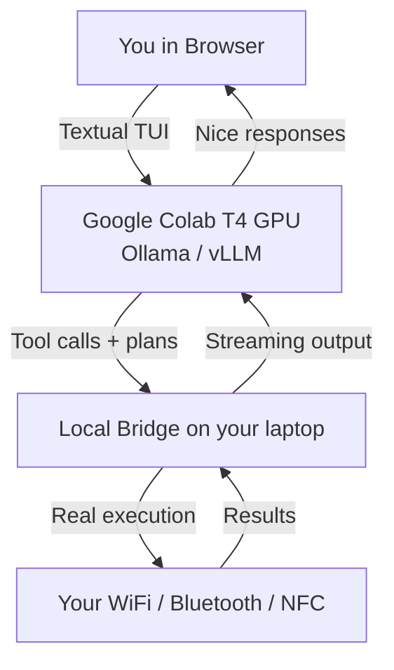

# kali-colab-agent

**Google Colab (T4 GPU) powered Kali Linux wireless security agent** with a rich Textual TUI.

This project lets you run a powerful local-style Kali wireless expert (with good coding + planning abilities) using Google Colab's free T4 GPU, while still being able to execute real commands on your own machine via a bridge.

## Why This Exists

Running good LLMs (7B–13B+ coding models) on a cheap VPS is painful — you’re limited to tiny models and slow CPU inference.

Google Colab gives you a free T4 GPU. This project turns that into a persistent, powerful Kali wireless agent you can talk to from a clean CLI interface.

## Architecture

**Components:**
- **Colab Notebook**: Runs the heavy model (qwen2.5-coder, deepseek-coder, etc.) with GPU.
- **TUI (Textual)**: Clean CLI interface you interact with (served via ttyd or similar).
- **Bridge**: Small agent on your laptop that gives the AI access to your real wireless hardware.

## Goals
- Much stronger models than the 1.5B–3B we were limited to on the VPS.
- Fast inference thanks to T4 GPU.
- Keep the familiar "Gemini CLI / Claude in terminal" feel.
- Still able to do real wireless work on your own hardware via the bridge.

## Current Status
Early stage. The bridge repo already exists and works on Windows. This new repo will focus on the Colab side + better TUI integration.

## Next Steps (being built)
- Colab notebook that runs Ollama with GPU + exposes an API
- TUI that talks to the Colab backend instead of local Ollama
- Improved bridge with better Windows support
- Proper token + authentication between TUI and bridge

## Getting Started (Coming Soon)

Watch this space. Once the first Colab notebook is ready, you’ll be able to:
1. Open the notebook in Colab
2. Run the cell that starts the model + tunnel
3. Connect your local TUI or bridge to it

## Related Repos
- [kali-wireless-bridge](https://github.com/deekaykay07-hub/kali-wireless-bridge) — The local hardware bridge (Windows first)
- [kali-mistral-tui](https://github.com/deekaykay07-hub/kali-mistral-tui) — The original VPS-based version (being superseded by this project)

## License
MIT
